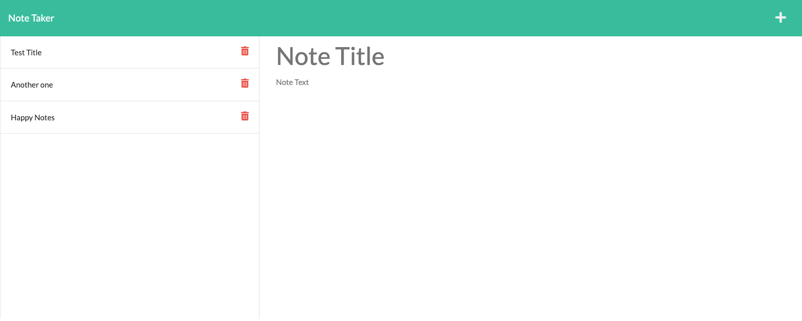

# 11 Express.js | Note Taker Application

Build of a back end application that uses express.js, to manage a front end note taking application. The front end application code was already provided.

---

**Table of Contents:**

* [Description](#description)
* [User Story](#user-story)
* [Installation](#installation)
* [Usage](#usage)
* [Acceptance Criteria](#acceptance-criteria)
* [Note Taking Application](#note-taking-application)
    * [Link to the deployed application](#link-to-the-deployed-application)
    * [Screenshot of the Note Taking Application](#screenshot-of-the-note-taking-application)
* [License](#license) 
* [Questions](#questions)

--- 

## Description

Generating JavaScript code, that uses the express.js framework to create a backend api that will create and store notes via a front end web application.

## User Story

AS A small business owner
I WANT to be able to write and save notes
SO THAT I can organize my thoughts and keep track of tasks I need to complete

## Acceptance Criteria

* GIVEN a note-taking application
* WHEN I open the Note Taker
* THEN I am presented with a landing page with a link to a notes page
* WHEN I click on the link to the notes page
* THEN I am presented with a page with existing notes listed in the left-hand column, plus empty fields to enter a new note title and the note’s text in the right-hand column
* WHEN I enter a new note title and the note’s text
* THEN a Save icon appears in the navigation at the top of the page
* WHEN I click on the Save icon
* THEN the new note I have entered is saved and appears in the left-hand column with the other existing notes
* WHEN I click on an existing note in the list in the left-hand column
* THEN that note appears in the right-hand column
* WHEN I click on the Write icon in the navigation at the top of the page
* THEN I am presented with empty fields to enter a new note title and the note’s text in the right-hand column

The main challenge i faced with this application, was understanding the GET and POST responses and requests, I am also still getting used to using the node.js fs functionality. However, by putting together the back end for this note taking application I was able to practice these code dev skills and used online resources such as MDN to help better my understanding.

## Note Taking Application

### Link to the deployed application

<a href="https://quiet-hamlet-00529.herokuapp.com/">Deployed Note Taking Application</a>

### Screenshot of the Note Taking Application

## License

NA

## Questions

If you have any questions, reach out at [@enigmawoman](https://github.com/enigmawoman) 
